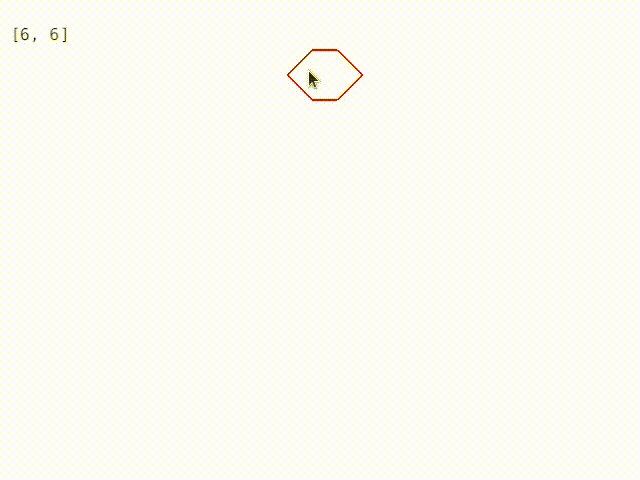

# `hexeng`: a crate for handling hexagonal tilings / grids / tesselation

A Rust library crate providing functions to:

* Convert between Axial hexagon coordinates and cartesian space.
* Apply an arbitrary "view" transform as necessary.
* That's it for now!

## Demo

```
cargo run --example demo
```



## More to read

* [API Documentation (with examples)](https://jthorniley.github.io/hexeng/doc/hexeng)
* [Demo code](https://github.com/jthorniley/hexeng/blob/master/examples/demo.rs)
* [Explanatory notes](https://jthorniley.github.io/notebooks/hex.html)
* [RedBlobGames hexagon notes](https://www.redblobgames.com/grids/hexagons/) -
  inspiration for much of this.

## Other useful crates

Some other crates that provide hex tiling algorithms:

* [Beehive](https://github.com/toasteater/beehive)
* [hex2d-rs](https://github.com/dpc/hex2d-rs)

# License

GPL 3.0 or later.
